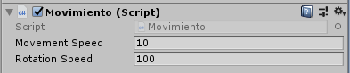
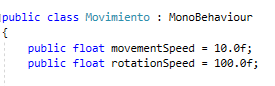
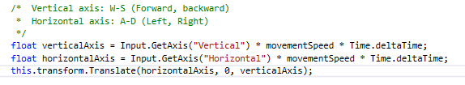
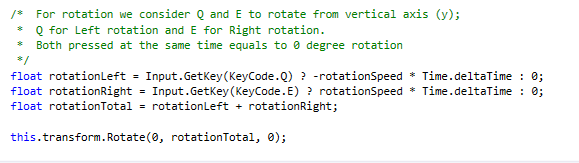

# Introducción a los scripts en Unity

## Objetivos

- [x] Crear un script para el personaje que lo desplace por la pantalla, sin aplicar simulación física.
- [x] Agregar un campo público que permita graduar la velocidad del movimiento desde el inspector de objetos.
- [x] Estar a la escucha de si el usuario ha utilizado los ejes virtuales. Elegir cuáles se va a permitir utilizar: flechas, awsd.
- [x] El recorrido virtual realizado con los contraladores (teclas) debe ser proporcional a lo que se desplaza el jugador:
  -[x] Si sólo pulsa una vez, corresponderá a una unidad, Unity asigna +1 o -1 según la dirección del movimiento
  -[x] Si se mantiene pulsado, el jugador debe avanzar en un movimiento continuo, así que Unity asigna un valor entre 0 y 1 ó 0 y -1.
  -[x] Una vez que tenemos la proporción del desplazamiento, este también debe ser proporcional a la velocidad que hemos establecido para el objeto. El objeto debe cumplir los siguientes requisitos en el movimiento:
    -[x] Se debe mover exclusivamente en el plano XZ de su sistema de referencia (su suelo)
    -[x] El avance se debe producir hacia adelante.
- [x] Elegir otros ejes virtuales para el giro y girar al jugador sobre el eje OY (up).

### Crear un script de movimiento

[File](script/movimiento.cs)

### Agrear campo público

### Utilizar los ejes virtuales

### Propiedades del desplazamiento

### Uso de un segundo eje virtual (rotación del personaje)

